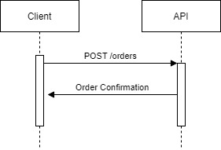

# Table of Contents
+ [About this application](#about-this-application)
  + [Sequence Diagram](#sequence-diagram)
+ [How to execute](#how-to-execute)
  + [Installing Dependencies](#installing-dependencies)
  + [Running the app](#running-the-app)
  + [Running tests](#running-tests)
  + [Building the app](#building-the-app)
+ [Available Endpoints](#available-endpoints)
  + [GET `/health`](#get-health)
  + [POST `/orders`](#post-orders)

# About this application

A bank needs to create a money order for a central bank. The order consists of:\

+ The ID of the bank ordering the money
+ The amount being ordered
+ A text containing any additional information

### Sequence Diagram


# How to execute

### Installing dependencies

To install the required dependencies run:
```bash
go mod tidy
```

### Running the app

Run the command:
```bash
go run .
```

### Running tests

You can run the unit tests by executing:
```bash
go test ./... -v
```

### Building the app

You can build the app by running:
```bash
go build -o bin/app
```

This will give you an executable file that you can run on you platform.

# Available endpoints

### GET `/health`

This is a healthcheck endpoint to make sure the app is up and running.

### POST `/orders`

The request body must be a json like the following:

```json
{
    "bankId": "f0b48033-dbb2-4bd5-b24d-8f8763e9461f", // The ID of the bank
    "amount": 100000.56, // The amount being requested
    "additionalInfo": "credit cards" // The additional information
}
```

The possible responses are:

+ `201`: The order was successful, you'll receive a json
containing the order with an `orderId`.
+ `400`: The request body is invalid.